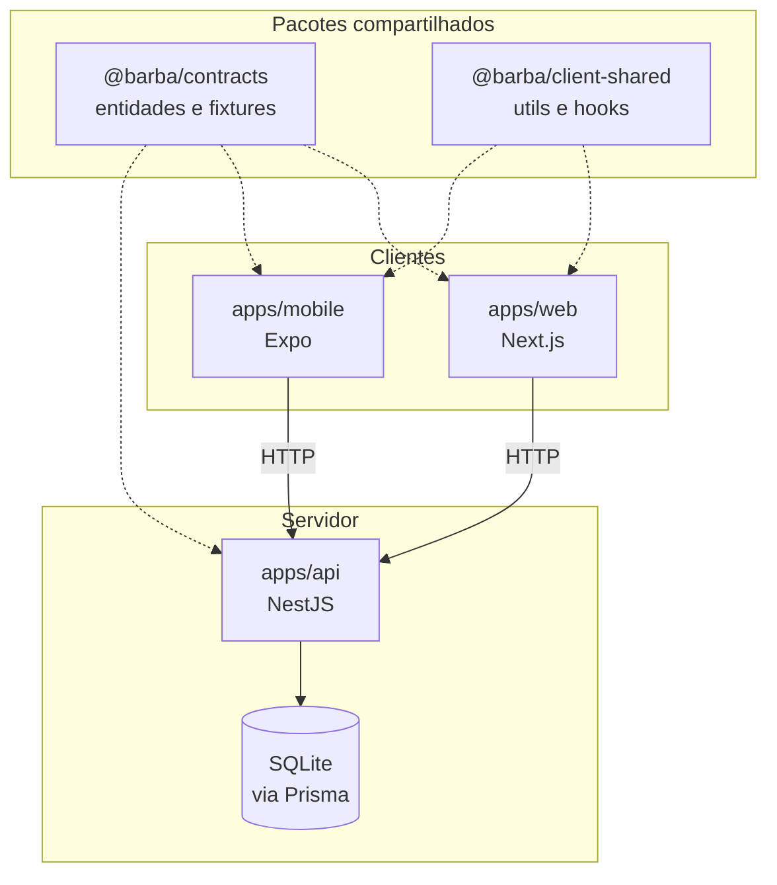

# 🪓 Barba Brutal

Sistema de agendamento para barbearia, com **API**, **site** e **aplicativo móvel**
compartilhando o mesmo modelo de domínio. Monorepo gerenciado com Turborepo.

> **Status:** em desenvolvimento. A reorganização estrutural está concluída;
> a integração ponta a ponta ainda não. Ver [Estado atual](#estado-atual).

---

## Stack

| Camada | Tecnologia |
|---|---|
| API | NestJS 10 · Prisma 5 · SQLite |
| Web | Next.js 14 (App Router) · Tailwind · shadcn/ui |
| Mobile | Expo 51 · React Native 0.74 · React Navigation |
| Monorepo | Turborepo 2 · Yarn Workspaces · TypeScript 5 |

---

## Arquitetura



A divisão dos pacotes segue quem consome o quê:

- **`@barba/contracts`** — as entidades (`Professional`, `Service`, `User`,
  `Scheduling`, `Client`) e as constantes de domínio. É o único pacote que os
  três aplicativos compartilham, porque é o que define o formato dos dados que
  trafegam entre eles. Compilado com `tsup`, já que a api roda em Node.
- **`@barba/client-shared`** — formatação de data, agenda e telefone, mais os
  hooks de catálogo. Só web e mobile usam. Distribuído como código-fonte, porque
  ambos os consumidores são bundlers que já transpilam TypeScript.

As **regras de negócio de servidor** ficam na api, em `src/scheduling/domain/`,
e não em pacote compartilhado — nenhum cliente as executa.

---

## Estrutura

```
apps/
├── api/                        NestJS
│   ├── prisma/                 schema, migrations e seed
│   └── src/
│       ├── db/                 PrismaService
│       ├── scheduling/
│       │   ├── domain/         GetBusySchedules, CalendarRepository
│       │   ├── scheduling.controller.ts
│       │   └── scheduling.repository.ts
│       └── service/
│
├── web/                        Next.js App Router
│   ├── public/                 imagens estáticas
│   └── src/
│       ├── app/
│       │   ├── (public)/       landing — sem autenticação
│       │   ├── (private)/      agendamento — exige usuário
│       │   ├── (auth)/login/   formulário de entrada
│       │   ├── providers.tsx   fronteira de client component
│       │   └── layout.tsx      layout raiz (server component)
│       ├── components/
│       │   ├── ui/             primitivos shadcn
│       │   ├── layout/         Page, Header, Footer, TopMenu, UserMenu
│       │   ├── common/         Logo, Title, Steps, Assessment…
│       │   └── features/       agrupado por domínio
│       └── data/               contexts e hooks
│
└── mobile/                     Expo
    ├── assets/
    └── src/
        ├── navigation/         RootNavigator
        ├── screens/
        ├── components/         mesma divisão common/features da web
        └── data/               contexts e hooks

packages/
├── contracts/                  entidades e fixtures de domínio
├── client-shared/              utils e hooks de web + mobile
├── eslint-config/
└── typescript-config/
```

Web e mobile usam a **mesma divisão de componentes** (`common/` para primitivos,
`features/<domínio>/` para o que pertence a um contexto de negócio), de modo que
quem lê um dos dois reconhece a organização do outro.

---

## Rodando o projeto

**Pré-requisitos:** Node 18+ e Yarn 1.x.

```bash
git clone https://github.com/Chris-Valentim/Barbearia.git
cd Barbearia
yarn install
```

Copie os arquivos de ambiente e ajuste se necessário:

```bash
cp apps/api/.env.example apps/api/.env
cp apps/web/.env.example apps/web/.env.local
```

Prepare o banco:

```bash
cd apps/api
npx prisma migrate dev     # cria o SQLite e aplica o schema
npx prisma db seed         # popula profissionais e serviços
```

Suba tudo:

```bash
yarn dev                   # api :3001 · web :3000 · mobile via Expo
```

Ou um app isolado:

```bash
yarn dev --filter=api
yarn dev --filter=web
yarn dev --filter=mobile
```

### Outros comandos

| Comando | O que faz |
|---|---|
| `yarn build` | Build de todos os workspaces |
| `yarn turbo check-types` | `tsc --noEmit` nos 5 workspaces |
| `yarn lint` | ESLint |
| `yarn format` | Prettier |

---

## Estado atual

O que **funciona**: build e verificação de tipos passam nos 5 workspaces; a web
renderiza as 5 rotas; a api compila e expõe os endpoints de serviço e agendamento.

O que **ainda não**: o fluxo de agendamento ponta a ponta. Há divergências
conhecidas entre o que os clientes chamam e o que a api expõe, e web e mobile
ainda listam profissionais e serviços a partir das fixtures em
`@barba/contracts` em vez de consumir a API.

### Próximos passos

- [ ] Alinhar as rotas de agendamento entre clientes e api
- [ ] Substituir as fixtures por chamadas HTTP
- [ ] Trocar `localStorage` por `AsyncStorage` no mobile
- [ ] Unificar os contexts duplicados entre web e mobile
- [ ] Migrar SQLite → PostgreSQL
- [ ] Cobertura de testes

---

## Convenções

Commits seguem [Conventional Commits](https://www.conventionalcommits.org/pt-br/)
com [gitmoji](https://gitmoji.dev/):

```
♻️ refactor(web): reorganiza componentes por camada e por domínio
```

Branches saem de `dev` no formato `<tipo>/v<versão>-<slug>` e voltam por merge
`--no-ff`. A `main` recebe apenas releases de `dev`.

---

## Licença

Projeto pessoal de estudo, sem licença de uso definida.
